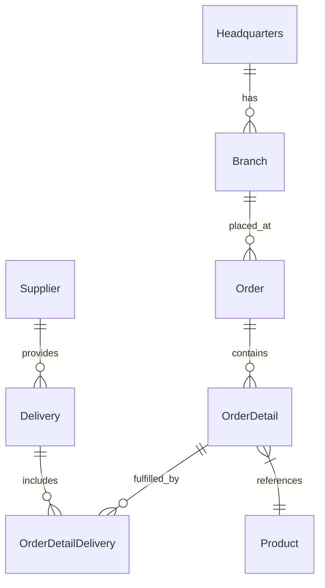

# OctoCAT Supply Architecture Reference

This document summarizes the architecture of the [OctoCAT Supply Chain Management](https://github.com/msft-common-demos/octocat_supply-ubiquitous-octo-bassoon) application for prompt authors working in this CCPR.

## Tech Stack

| Layer | Technology |
|-------|------------|
| Frontend | React 18+, TypeScript, Tailwind CSS, Vite |
| Backend | Express.js, TypeScript, SQLite, OpenAPI/Swagger |
| Database | SQLite (file: `api/data/app.db`, in-memory for tests) |
| DevOps | Docker, Docker Compose, Bicep (Azure Container Apps) |

## Entity Relationship Diagram

## Database Tables

- `suppliers` - Supplier information
- `headquarters` - Company headquarters data
- `branches` - Branch locations (linked to headquarters)
- `products` - Product catalog (linked to suppliers)
- `orders` - Customer orders (linked to branches)
- `order_details` - Order line items (linked to orders and products)
- `deliveries` - Delivery tracking (linked to suppliers)
- `order_detail_deliveries` - Junction table for order-delivery relationships

## Backend Patterns

- **Repository Pattern**: All data access through repository classes in `api/src/repositories/`
- **Model Mapping**: camelCase TypeScript interfaces map to snake_case database columns
- **Error Types**: Custom errors (NotFound, Validation, Conflict) with consistent HTTP status codes
- **Swagger**: Inline OpenAPI annotations on all route handlers

## Frontend Patterns

- Components in `frontend/src/` using TypeScript (.tsx)
- Tailwind CSS utility classes for styling
- Vite dev server on port 5173 with API proxy to backend port 3000

## Environment Variables

| Variable | Default | Description |
|----------|---------|-------------|
| `DB_FILE` | `api/data/app.db` | SQLite database file path |
| `DB_ENABLE_WAL` | `true` | Enable Write-Ahead Logging |
| `DB_FOREIGN_KEYS` | `true` | Enforce foreign key constraints |
| `DB_TIMEOUT` | `30000` | Busy timeout in ms |

## Build Commands

| Command | Description |
|---------|-------------|
| `make install` | Install all dependencies |
| `make dev` | Start API + frontend dev servers |
| `make build` | Production build (API + frontend) |
| `make test` | Run all tests |
| `make db-init` | Initialize database (migrations + seed) |
| `make lint` | Run linting checks |
